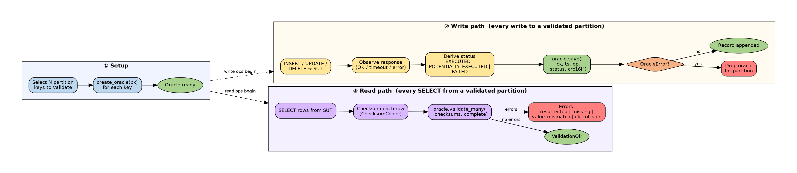
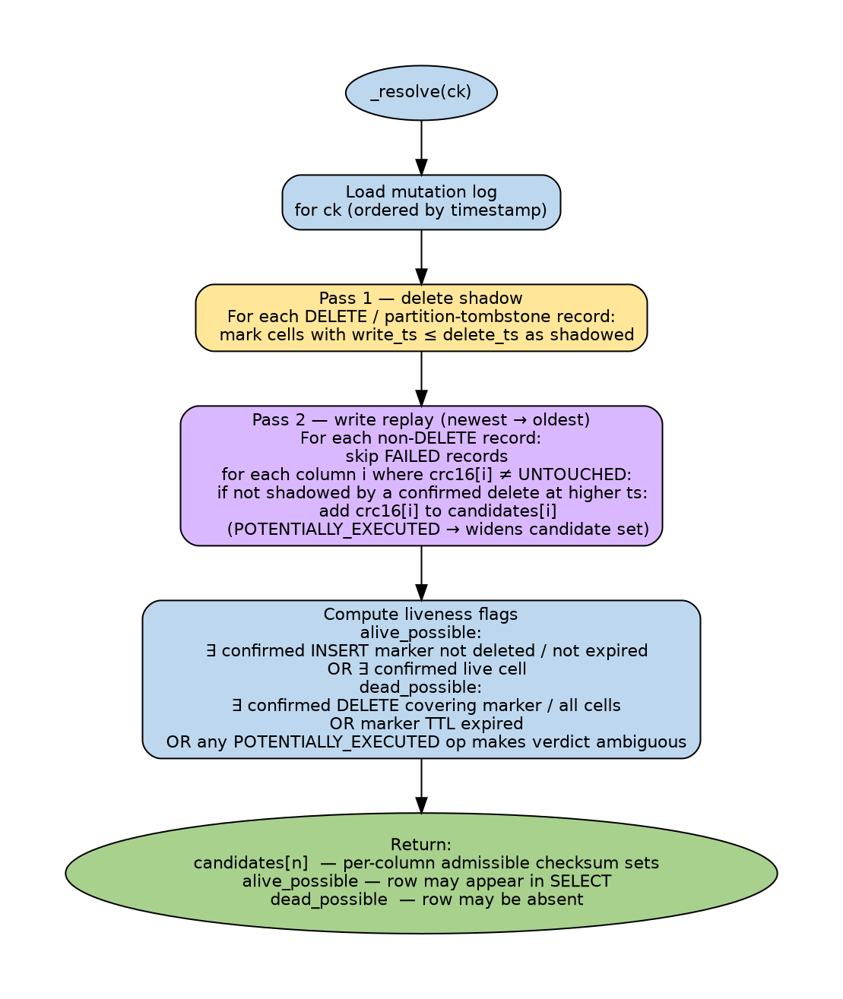
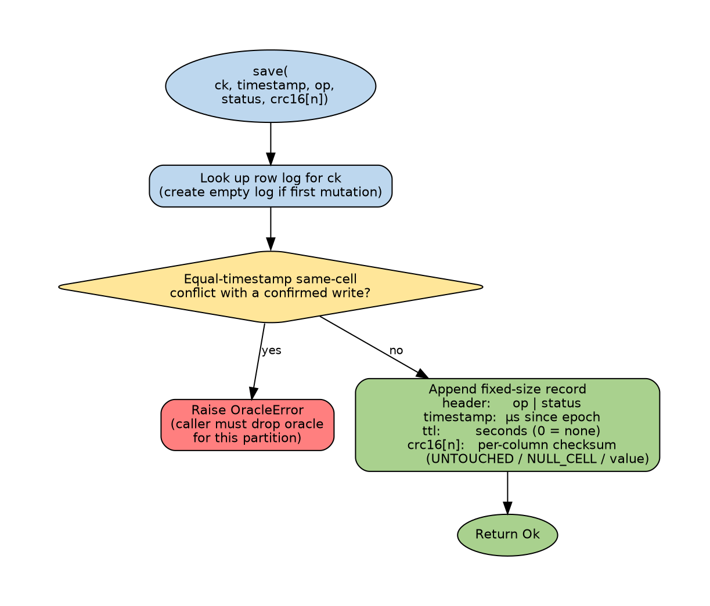
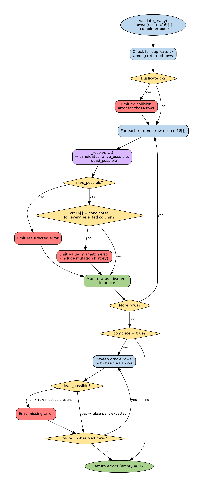

# In-Memory Oracle for ScyllaDB Data Validation

## Purpose

Design a library that performs strong correctness validation of a ScyllaDB cluster under a
stress workload. It must:

1. Support the full mutation surface: `INSERT`, `UPDATE`, and `DELETE`.
2. Keep an authoritative model ("oracle") of the expected data **entirely in memory**.
3. Detect **resurrection**: after a partition (or row) is deleted, verify that the data
   does not silently reappear (tombstone resurrection, broken repair, a node returning
   from a long outage, etc.).

Validation must be strong enough to catch value corruption *and* missing/extra rows, while
using little enough memory to run alongside a high-throughput workload without an auxiliary
database. It does **not** attempt to validate the entire dataset — see *Scope & detection
model* — only a bounded, pre-selected subset of partitions.

**API scope: CQL only.** The engine (mutation log, LWW replay, liveness, checksum compare) is
API-agnostic, but the semantics modelled below — cell timestamps, row markers, cell-level TTL,
canonical CQL serialization — are CQL's. DynamoDB/Alternator support is future work; see
`latte_with_oracle.md` § *DynamoDB / Alternator applicability* for the adapter-level deltas.

The library is consumed by a stress tool (Latte, a Rust-based load generator with Rune
scripting, is the primary target). This document gives reference pseudocode in Python; the
production implementation is Rust. **The pseudocode expresses the API and the intended
behavior (the *what*), not the production data structures or memory layout (the *how*).**
The byte-level record layout below fixes the per-mutation cost that drives the memory
budget; everything else (how logs are stored, indexed, or reclaimed) is an implementation
concern and may change.

## Problems with current tools

| Tool                 | Limitation |
|----------------------|------------|
| **Gemini**           | Uses a second, real ScyllaDB cluster as the oracle (SUT + oracle, mirrored mutations). Correct but **expensive** (extra cluster) and **slow**. |
| **Latte**            | Only basic validation. Inserts can be tracked; **updates and deletes cannot be tracked well**. |
| **cassandra-stress** | Very limited validation complexity. |

## Core idea

Keep Gemini's "compare SUT against an oracle" approach, but make the oracle a compact,
**in-memory** model instead of a second cluster.

A stress tool drives a workload. On every mutation it applies to a partition, it also
records that mutation in an in-memory **partition oracle**. During the read phase it
`SELECT`s rows from the SUT and asks the oracle whether each returned row's values are what
they should be — accounting for the row's full history of inserts, updates, deletes, TTL
expiry, and the ScyllaDB row marker. Any discrepancy is reported together with the mutation
history that produced the expected value, so a human can later see *what operation happened
and when* (not the raw values — see *What the oracle does and does not store*).

Storing full row data in memory is infeasible — the oracle would be as large as the data
pushed into the SUT. The key trick: **store only checksums and metadata**, never the
values themselves.

The end-to-end flow — setup, the write path that mirrors each mutation into the oracle, and
the read path that checksums SUT rows and validates them:



## Scope & detection model

This oracle is **not** intended to validate every partition. It validates a bounded,
pre-selected **subset** of partitions (target: a few thousand keys), sized so its memory
footprint fits a fixed budget. The rest of the workload runs unvalidated (or is validated by
other means).

This works because of *how* disruptions destroy data. Test disruptions — node restarts,
process kills, drive/sstable corruption, repair faults, nodes returning from long outages —
typically damage data at the granularity of **whole sstables or time ranges**, not a single
isolated row. Such an event spans a broad, roughly contiguous slice of the keyspace, so a
randomly-sampled validated subset intersects it with high probability and the corruption
surfaces through the validated members inside the slice. Quantitatively, if an event damages
fraction `f` of the data and we validate `s` partitions, the chance we miss it entirely is
`≈ (1 − f)^s`: for a bulk event (`f` = 1%, `s` = 3,000) detection is effectively certain.

**The honest converse:** a *single-row* or *single-partition* fault — e.g. one missed
tombstone that resurrects exactly one row after `gc_grace` — has `f ≈ 1/total_partitions`, so
`P(detect) ≈ s/total`, usually tiny. The sampling argument therefore targets **bulk** loss
and resurrection; isolated resurrection of an unsampled row is not guaranteed to be caught.
This is acceptable because the disruptions this tool exercises produce bulk damage, but it
should not be sold as "detects any resurrection."

Coverage also depends on rates: with a low delete/update rate and modest throughput the
budget may comfortably hold **every** touched partition, giving full coverage; coverage only
degrades toward a sample as mutation volume grows past the budget.

Consequence for memory: footprint is `sample_size × per-row cost` (see *Memory
calculations*), fixed up front, not a function of total workload volume. There is no need for
aggressive runtime eviction (though reclaiming dead rows would stretch the budget — see
*Future work*).

## Design overview & terminology

- **Partition oracle** — one independent oracle per validated ScyllaDB partition. Partitions
  are managed (and dropped) independently. The partition key selects *which* oracle; it is
  not stored inside the oracle.
- **Clustering-key checksum (`ck`)** — a single CRC-64 (8 B) identifying a row *within* a
  partition, computed from the row's clustering-key values. CRC-64 makes intra-partition
  collisions negligible at any realistic partition size (see *Collision probability*).
- **Mutation record** — one fixed-size record describing a single mutation
  (`INSERT`/`UPDATE`/`DELETE`) applied to one row. It stores per-column value checksums
  plus metadata (timestamp, TTL, operation, status).
- **Mutation log** — per row, the **full ordered list** of mutation records. Expected state
  is computed on demand by replaying the log, which keeps the complete operational history
  available to explain a validation failure. Every mutation adds one fixed-size record, so
  memory grows linearly with the number of mutations (see *Memory management*).
- **Row marker** — ScyllaDB tracks an invisible per-row liveness marker. `INSERT` creates a
  live marker; `UPDATE` does not. A row is visible in `SELECT` if its marker is alive **or**
  it has at least one live cell. The oracle models this explicitly (see *Liveness*).
- **Checksum codec** — a stateless, schema-bound helper that converts a raw SUT row into a
  compact `RowChecksum`. It owns no oracle state, so it is thread-safe and runs on the
  fetch threads, overlapping with read I/O.

## ScyllaDB semantics this oracle reproduces

The oracle must match ScyllaDB's actual conflict-resolution and liveness rules, not an
approximation. The non-obvious ones, which drive the replay logic:

1. **Cell-level timestamps, microsecond resolution.** Every cell carries its own write
   timestamp in microseconds. LWW is resolved per cell, not per row or per statement.
2. **Per-cell delete shadowing.** A row-level `DELETE` at timestamp `T` kills exactly the
   cells whose timestamp is `≤ T`. A later write to a *different* column (timestamp `> T`)
   survives, while a column written *before* `T` and not rewritten becomes NULL. Deletes are
   **not** all-or-nothing for the row.
3. **Row marker.** `INSERT` creates a live row marker; `UPDATE` does not. A row created only
   by `UPDATE`s disappears from `SELECT` once all its cells are deleted/expired, whereas an
   `INSERT`ed row remains visible (as all-nulls) until its marker is deleted or its marker
   TTL expires.
4. **TTL clock.** Cell expiry is measured against the **coordinator's wall clock at write
   time + TTL**, rounded to 1-second resolution; the `USING TIMESTAMP` value is *not* used
   for expiry. The oracle therefore treats expiry approximately and applies a grace window
   (see *TTL handling*).
5. **Equal-timestamp ties.** At identical timestamps Scylla breaks ties deterministically
   (a tombstone beats a live cell; otherwise the lexicographically larger value wins). A
   tombstone-vs-write tie is reproducible (the oracle's delete shadow already uses `≤`, so a
   same-timestamp delete wins). A *value-vs-value* tie is **not** reproducible from a
   checksum, so two writes (or two `INSERT` markers) touching the same cell at the identical
   microsecond make the partition untrustworthy: `save()` raises `OracleError` and the caller
   drops the oracle (see *Limitations*). The caller must not issue same-microsecond same-cell
   writes.

## Data model

### Checksums and sentinels

Two CRC-16 codes are reserved so that "explicit NULL" and "column not written / not
selected" are unambiguous. The value hash is wrapped so a real value can never collide with
a reserved code; the sentinel in the `crc16` slot alone tells whether a column was written,
was set to NULL, or holds a value.

```python
NULL_CELL     = 0xFFFF   # cell explicitly set to NULL (a write that deletes the cell)
UNTOUCHED     = 0xFFFE   # column not written by this mutation / not selected by this read
MAX_VALUE_CRC = 0xFFFD   # real value hashes are clamped to this ceiling


def value_crc16(value) -> int:
    """CRC-16 of one column value, guaranteed in 0x0000..0xFFFD so it can never look like
    NULL_CELL or UNTOUCHED. The two raw values that would collide (0xFFFE, 0xFFFF) are
    clamped down to MAX_VALUE_CRC; this adds a negligible amount of extra collision at
    0xFFFD and keeps the sentinels unambiguous.

    `serialize(value)` MUST produce the same bytes for a value the caller wrote and for the
    same value decoded back from the SUT. Use the driver's canonical CQL serialized form
    (see Type handling)."""
    h = crc16(serialize(value))          # raw CRC-16, 0x0000..0xFFFF
    return h if h <= MAX_VALUE_CRC else MAX_VALUE_CRC


def compute_ck(clustering_keys: list) -> int:
    """CRC-64 identifying a row within its partition.

    The clustering-key values are serialized into a single canonical, length-prefixed
    buffer and hashed once. We deliberately do NOT sum per-key CRCs: summing is
    order-insensitive, so (a, b) and (b, a) would collide, and so would many unrelated key
    tuples. Length-prefixing prevents ambiguity between e.g. ("ab","c") and ("a","bc").
    """
    buf = bytearray()
    for v in clustering_keys:
        e = serialize(v)
        buf += len(e).to_bytes(4, "big")
        buf += e
    return crc64(bytes(buf)) & 0xFFFFFFFFFFFFFFFF
```

### Mutation record (fixed size)

Each mutation applied to a row produces exactly one record. For a table with `n` value
columns (clustering keys are summarized by the `ck` that keys the log, not stored here):

| Field        | Type      | Bytes | Meaning |
|--------------|-----------|-------|---------|
| `header`     | u8        | 1     | bits 0-1 = operation, bits 2-3 = status, bits 4-7 reserved |
| `timestamp`  | u64       | 8     | Write timestamp, **microseconds since the Unix epoch** (the same value used for LWW against Scylla) |
| `ttl`        | u16       | 2     | TTL in seconds for cells written by this mutation; `0` = no TTL |
| `crc16[n]`   | u16 × n   | `2n`  | Per-column value checksum. `UNTOUCHED` ⇒ not written by this mutation; `NULL_CELL` ⇒ written as explicit NULL; else value hash |

**Fixed record size:** `record_bytes(n) = 1 + 8 + 2 + 2n = 11 + 2n`.

The `ck` (8 B, CRC-64) is **not** part of this record — it is the per-row log key, stored
once per row regardless of how many mutations the row accumulates. It is therefore charged to
the per-row overhead, not to `record_bytes` (see *Memory calculations*).

A `DELETE` record sets every `crc16` slot to `UNTOUCHED`; it carries meaning purely through
its operation bits and timestamp. The microsecond timestamp is absolute (epoch-based), so
there is no start-time offset and no rollover window to manage.

### Null vs. not-written vs. not-selected

The two sentinels disambiguate three cases CQL and partial reads otherwise conflate:

- **Not written** by a mutation — `crc16[i] = UNTOUCHED`. The column does not participate
  in this record's LWW.
- **Explicitly set to NULL** — `crc16[i] = NULL_CELL`. A real write that deletes the cell;
  it participates in LWW and, if it wins, the expected value is "null".
- **Not selected** by a read — in a `RowChecksum`, `crc16[i] = UNTOUCHED`. Validation skips
  that column (a partial projection validates only the columns it returned).

### Statuses & "potentially executed"

`status` is derived from the SUT's response to the write. The key fact: **ScyllaDB never
rolls back a write.** A write that reached the coordinator may have been persisted on one or
more replicas even if the client got a failure or timeout, and will then surface on a later
QUORUM read (via read repair, or because that replica is in the quorum). The driver can only
report "not enough acknowledgements," never "not applied." So almost every non-success maps
to `POTENTIALLY_EXECUTED`, not `FAILED`:

- `EXECUTED` — acknowledged by the required replicas; participates in expected state
  normally.
- `POTENTIALLY_EXECUTED` — timeout, unavailable-after-dispatch, or any error **after** the
  mutation could have reached a replica. May or may not be present. The oracle handles this
  **conservatively**: a potential record never causes a false positive.
- `FAILED` — reserved for the narrow case where the write provably never reached any replica
  (a client-side serialization error, or an `Unavailable` rejected before any mutation was
  dispatched). Only then is it excluded from expected state. When in doubt, use
  `POTENTIALLY_EXECUTED`.

Conservative handling of a `POTENTIALLY_EXECUTED` record:

- For each column it touches, its value is added to that column's candidate set *only if
  it could actually win* (its timestamp is above any confirmed winner for that column —
  a potential write below a later confirmed write can never be observed and is excluded).
- A potential `DELETE`, potential `INSERT`, or any potential write makes the row's
  **liveness ambiguous**: both "present" and "absent" become admissible for that row, so
  the resurrection/missing checks are suppressed for it.

### Partition tombstone & resurrection

A partition oracle records partition-level deletes via a `partition_tombstone_ts`. During
replay it acts as a confirmed delete shadow at that timestamp (covering every cell and the
row marker with `ts ≤ partition_tombstone_ts`). A deleted partition's oracle is **kept** (not
dropped) precisely so that a later `SELECT` returning a row with no write *after* the
tombstone is flagged as resurrection. A row legitimately re-`INSERT`ed or rewritten after the
tombstone (`ts > partition_tombstone_ts`) is correctly live and not flagged.

## Liveness (how the oracle decides a row should be visible)

Replaying a row's log yields, per column, a set of admissible value checksums, plus two
liveness flags:

- `alive_possible` — the row may legitimately appear in a `SELECT`.
- `dead_possible` — the row may legitimately be absent.

A row is **confirmed alive** if its marker is alive (`INSERT` whose timestamp beats every
confirmed delete and whose marker TTL has not expired) **or** it has at least one live cell
(a confirmed non-NULL winning value not shadowed by a delete and not expired). Potential
operations widen the verdict to ambiguous (both flags true). With no ambiguity exactly one
flag is true.

Validation rules:
- SUT returns the row ⇒ require `alive_possible`; else `resurrected`.
- Whole-partition read, SUT omits the row ⇒ error (`missing`) only if **not** `dead_possible`.

This is what makes an `UPDATE`-only row that has lost all its cells correctly disappear
(no marker ⇒ not `alive_possible`), while an `INSERT`ed all-nulls row stays visible.

`_resolve` is the heart of this: a two-pass replay of the row's mutation log into per-column
candidate checksums plus the two liveness flags.



## Storage layout (per partition oracle)

Conceptually a per-partition oracle holds, per row, an **ordered list of fixed-size mutation
records** keyed by `ck`, plus a per-partition `partition_tombstone_ts`. The two numbers that
matter for the memory budget are the fixed per-mutation record cost (`record_bytes(n) =
11 + 2n`) and the one-time per-row cost: the 8 B `ck` log key plus the index entry and the
list's own header/slack, a small constant we model as **~24 B/row** (8 B `ck` + ~16 B
bookkeeping) for sizing.

*How* those lists and the `ck → list` lookup are actually stored — flat arena, per-row
`Vec`, growable blocks, hash vs. linear index — is an implementation choice that trades
memory overhead against append/lookup speed. It does not change the design or the budget; a
more compact layout simply lets us validate a larger fraction of the workload (see *Memory
management* and *Future work*). A partition holds at most a few thousand rows, so even a
naive layout is cheap.

## Write & validate decision flows

`save()` appends one fixed-size record. It raises `OracleError` only on an equal-microsecond
same-cell conflict (a value tie a checksum cannot reproduce), so the caller drops the
partition:



`validate_many()` checks each returned row against its resolved state (unexpected /
resurrected / value_mismatch / ck_collision when two returned rows share a `ck`), then, for a
whole-partition read (`complete=True`), sweeps the oracle's un-observed rows for `missing`:



## API (Python pseudocode)

```python
from enum import IntEnum
from dataclasses import dataclass


UNSET = object()   # caller sentinel: "this column was not written / not selected".
# Explicit NULL is represented by Python None.

ALIVE, EXPIRED, AMBIGUOUS = 0, 1, 2   # cell TTL states


class Operation(IntEnum):
    INSERT = 0      # creates a row marker
    UPDATE = 1      # no row marker
    DELETE = 2      # row-level delete


class Status(IntEnum):
    EXECUTED = 0
    POTENTIALLY_EXECUTED = 1   # any failure/timeout AFTER dispatch — tolerated either way
    FAILED = 2                 # provably never reached a replica (pre-dispatch error only)


def pack_header(op: Operation, st: Status) -> int:
    return (op & 0x3) | ((st & 0x3) << 2)

def unpack_header(h: int) -> tuple[Operation, Status]:
    return Operation(h & 0x3), Status((h >> 2) & 0x3)


@dataclass
class RowChecksum:
    """Compact form of one SUT row. The raw row can be discarded once this exists."""
    ck: int
    crc16: list          # length n; NULL_CELL / UNTOUCHED / value hash


@dataclass
class ValidationError:
    ck: int
    kind: str            # "value_mismatch" | "missing" | "resurrected" | "unexpected_row"
                         #                   | "ck_collision"
                         #   resurrected    : ck the oracle knows, deleted/expired, SUT returned it
                         #   unexpected_row : ck the oracle has no record of at all
                         #   ck_collision   : two SUT rows share one ck -> partition untrustworthy
    detail: str
    mutation_log: list   # dump of the row's records (header, ts, ttl, crc16) for diagnosis


# -------------------------------------------------------------------------------------
# Stateless, schema-bound, thread-safe. Run on fetch threads, concurrently with read I/O.
# -------------------------------------------------------------------------------------
class ChecksumCodec:

    def __init__(self, clustering_key_names: list[str], column_names: list[str]):
        self.clustering_key_names = clustering_key_names
        self.column_names = column_names
        self.n = len(column_names)

    def row_to_checksum(self, clustering_keys: list, columns: list) -> RowChecksum:
        """Convert one raw SUT row into compact checksum form, then the caller discards the
        raw row and fetches the next.

        columns : full-width list aligned to column_names. Each entry is a concrete value,
                  None (the SUT returned NULL), or UNSET (column not in the projection).
        """
        crc = [0] * self.n
        for i, v in enumerate(columns):
            if v is UNSET:
                crc[i] = UNTOUCHED          # not selected -> validation skips it
            elif v is None:
                crc[i] = NULL_CELL
            else:
                crc[i] = value_crc16(v)
        return RowChecksum(compute_ck(clustering_keys), crc)


# -------------------------------------------------------------------------------------
# Holds each row's mutation log (keyed by ck) + the partition tombstone. Single-writer per
# partition; no concurrent reader+writer on the same partition (see Concurrency contract).
# -------------------------------------------------------------------------------------
class PartitionOracle:

    def __init__(self, codec: ChecksumCodec, ttl_grace_secs: int = 5):
        self.codec = codec
        self.n = codec.n
        self.ttl_grace_secs = ttl_grace_secs

        # Storage is intent-only here: each row keeps an ordered list of its mutation
        # records, keyed by ck. The production layout (allocation, indexing) is an
        # implementation concern — see Storage layout.
        self._rows = {}                 # ck -> list[MutationRecord]
        self.partition_tombstone_ts = None

        self._size_bytes = 0
        self._record_size = 11 + 2 * self.n
        # per-row overhead = 8 B ck (CRC-64 log key, stored once) + ~16 B index/list bookkeeping
        self._row_overhead = 8 + 16      # = 24 B per row

    # ---- writing ----------------------------------------------------------------

    def save(self, clustering_keys: list, columns: list, operation: Operation,
             status: Status, ttl: int, timestamp_us: int) -> int:
        """Record one mutation applied to one row by appending one record to its ck's log.
        Returns the row's ck.

        columns      : full-width list aligned to column_names: value | None (NULL) |
                       UNSET (not written). Ignored for DELETE (pass all UNSET).
        timestamp_us : the write timestamp, microseconds since the Unix epoch. This MUST be
                       the timestamp Scylla used for the write (see Integration: timestamps).

        Marker and liveness semantics are derived entirely by replaying the log (see
        _resolve); the operation may appear in any order:
        INSERT : appends a record carrying a row marker.
        UPDATE : appends a record; UNTOUCHED slots leave prior history intact; no marker.
        DELETE : appends a row-level tombstone (all crc16 = UNTOUCHED).

        Equal-microsecond guard: if this record touches a cell (or the marker) at the exact
        timestamp of an existing record that also touches it, the value-based tie-break cannot
        be reproduced from checksums -> raises OracleError, caller drops the oracle (see
        Limitations).
        """
        ck = compute_ck(clustering_keys)
        existing = self._rows.get(ck)
        record = self._build_record(columns, operation, status, ttl, timestamp_us)

        if existing is not None:
            self._reject_equal_ts_conflict(existing, record)   # raises OracleError on a same-ts tie
            existing.append(record)
            self._size_bytes += self._record_size
        else:
            self._rows[ck] = [record]
            self._size_bytes += self._row_overhead + self._record_size
        return ck

    def delete_partition(self, timestamp_us: int) -> None:
        """Record a partition-level delete. The oracle is retained so resurrection can
        still be detected."""
        if self.partition_tombstone_ts is None or timestamp_us > self.partition_tombstone_ts:
            self.partition_tombstone_ts = timestamp_us

    def _build_record(self, columns, operation, status, ttl, timestamp_us):
        crc16 = [UNTOUCHED] * self.n
        if operation != Operation.DELETE:
            for i, v in enumerate(columns):
                if v is UNSET:
                    continue
                crc16[i] = NULL_CELL if v is None else value_crc16(v)
        return MutationRecord(pack_header(operation, status), timestamp_us, ttl, crc16)

    # ---- validation -------------------------------------------------------------

    def validate_many(self, checksums: list[RowChecksum], now_us: int,
                      complete: bool = False) -> list[ValidationError]:
        """Validate a batch of pre-computed row checksums (one SELECT's worth).

        The caller streams SUT rows through the codec, discarding each raw row immediately,
        and passes only the compact checksums here. Validation does only integer comparisons;
        no value hashing happens inside the oracle.

        now_us   : current time, microseconds since epoch, for TTL expiry.
        complete : True when this batch is a WHOLE-partition read (no narrowing WHERE on
                   clustering keys). Gates ONLY the `missing` check (oracle expects a row the
                   SUT did not return) — that is the one verdict requiring knowledge of the
                   full row set, so the read MUST then be consistent with the oracle's write
                   history (see Concurrency contract).

                   The per-row checks always run, regardless of `complete`:
                   `unexpected_row`, `resurrected`, and `value_mismatch`. In particular an
                   `unexpected_row` (a ck the oracle never recorded) is ALWAYS an error: the
                   workload failed to `save()` it, or it is a bogus/corrupt row. There is no
                   mutation log to attach, so `mutation_log` is empty.
        """
        errors = []
        observed = set()

        for rc in checksums:
            if rc.ck in observed:
                # Two SUT rows in one read carry the same ck => two distinct clustering keys
                # collided on the CRC-64. The oracle has merged their histories and can no
                # longer be trusted for this partition; the caller drops it.
                errors.append(ValidationError(rc.ck, "ck_collision",
                    "two SUT rows share one ck (CRC-64 collision); drop this partition oracle",
                    []))
                continue
            observed.add(rc.ck)
            chain = self._rows.get(rc.ck)
            if chain is None:
                errors.append(ValidationError(rc.ck, "unexpected_row",
                    "row present in SUT but the oracle has no record of this ck", []))
                continue
            r = self._resolve(chain, now_us)
            if not r.alive_possible:
                errors.append(ValidationError(rc.ck, "resurrected",
                    "row should be deleted/expired but SUT returned it", list(chain)))
                continue
            for i, obs in enumerate(rc.crc16):
                if obs == UNTOUCHED:                  # column not selected -> skip
                    continue
                if obs not in r.candidates[i]:
                    errors.append(ValidationError(rc.ck, "value_mismatch",
                        f"column '{self.codec.column_names[i]}' mismatch", list(chain)))
                    break

        if complete:
            for ck, chain in self._rows.items():
                if ck in observed:
                    continue
                r = self._resolve(chain, now_us)
                if r.alive_possible and not r.dead_possible:
                    errors.append(ValidationError(ck, "missing",
                        "oracle expects row but SUT did not return it", list(chain)))
        return errors

    def validate(self, clustering_keys: list, columns: list, now_us: int
                 ) -> list[ValidationError]:
        """Convenience wrapper validating a single raw row. Prefer validate_many for whole
        partitions."""
        rc = self.codec.row_to_checksum(clustering_keys, columns)
        return self.validate_many([rc], now_us, complete=False)

    def _cell_state(self, rec, now_us: int) -> int:
        """TTL state with a grace window absorbing coordinator clock skew and Scylla's
        1-second expiry rounding. Uses the record timestamp as the TTL base, which holds as
        long as the caller does not backdate timestamps far from wall-clock time."""
        if rec.ttl == 0:
            return ALIVE
        expiry = rec.timestamp + rec.ttl * 1_000_000
        grace = self.ttl_grace_secs * 1_000_000
        if now_us > expiry + grace:
            return EXPIRED
        if now_us < expiry - grace:
            return ALIVE
        return AMBIGUOUS

    def _resolve(self, chain, now_us: int) -> "ResolvedRow":
        """Replay a row's mutation log into per-column candidate checksums and a liveness
        verdict, honoring per-cell LWW, per-cell delete shadowing, the row marker, TTL
        expiry (with grace), FAILED exclusion, and POTENTIALLY_EXECUTED ambiguity.

        `chain` is the row's ordered list of MutationRecords."""
        records = chain

        # Pass 1 — confirmed delete shadow (EXECUTED row-deletes + partition tombstone).
        confirmed_del = self.partition_tombstone_ts if self.partition_tombstone_ts is not None else -1
        ambiguous = False
        for rec in records:
            op, st = unpack_header(rec.header)
            if st == Status.FAILED or op != Operation.DELETE:
                continue
            if st == Status.EXECUTED:
                confirmed_del = max(confirmed_del, rec.timestamp)
            else:                                   # potential delete -> liveness ambiguous
                ambiguous = True

        # Pass 2 — writes, honoring shadow + TTL.
        best = [None] * self.n                       # (ts, crc) confirmed winner per column
        potential = [[] for _ in range(self.n)]      # (ts, crc) candidates from potentials
        marker_ts = -1
        marker_potential = False

        for rec in records:
            op, st = unpack_header(rec.header)
            if st == Status.FAILED or op == Operation.DELETE:
                continue
            state = self._cell_state(rec, now_us)
            if state == EXPIRED:
                continue
            if rec.timestamp <= confirmed_del:       # shadowed by a confirmed delete
                continue

            soft = (st == Status.POTENTIALLY_EXECUTED) or (state == AMBIGUOUS)
            if op == Operation.INSERT:
                if soft:
                    marker_potential = True
                else:
                    marker_ts = max(marker_ts, rec.timestamp)

            for i in range(self.n):
                if rec.crc16[i] == UNTOUCHED:
                    continue
                if soft:
                    potential[i].append((rec.timestamp, rec.crc16[i]))
                elif best[i] is None or rec.timestamp > best[i][0]:
                    best[i] = (rec.timestamp, rec.crc16[i])

        # Finalize per-column candidate sets.
        candidates = [set() for _ in range(self.n)]
        has_live_cell = False
        for i in range(self.n):
            floor = best[i][0] if best[i] is not None else confirmed_del
            if best[i] is not None:
                candidates[i].add(best[i][1])
                if best[i][1] != NULL_CELL:
                    has_live_cell = True
            else:
                candidates[i].add(NULL_CELL)         # no confirmed value -> NULL admissible
            for ts, crc in potential[i]:             # potentials that could actually win
                if ts > floor:
                    candidates[i].add(crc)

        # Liveness.
        marker_alive = marker_ts > confirmed_del
        confirmed_alive = marker_alive or has_live_cell
        soft_life = ambiguous or marker_potential or any(potential[i] for i in range(self.n))
        return ResolvedRow(
            alive_possible=confirmed_alive or soft_life,
            dead_possible=(not confirmed_alive) or soft_life,
            candidates=candidates)

    # ---- helpers ----------------------------------------------------------------

    def _reject_equal_ts_conflict(self, existing: list, record) -> None:
        """Raise OracleError if `record` touches a cell (or the marker) at the exact same
        timestamp as an existing record that also touches it. Scylla resolves such ties by
        value, which a checksum cannot reproduce, so the partition is no longer trustworthy
        (caller drops it)."""
        op, _ = unpack_header(record.header)
        for prior in existing:
            if prior.timestamp != record.timestamp:
                continue
            pop, _ = unpack_header(prior.header)
            # marker-vs-marker, or any shared touched cell, at an identical timestamp
            if op == pop == Operation.INSERT:
                raise OracleError("equal-timestamp marker conflict", record.timestamp, list(existing))
            for i in range(self.n):
                if record.crc16[i] != UNTOUCHED and prior.crc16[i] != UNTOUCHED:
                    raise OracleError("equal-timestamp same-cell conflict", record.timestamp,
                                      list(existing))

    def get_size(self) -> int:
        """Current memory footprint of this oracle in bytes (running counter, O(1)).
        Illustrative: a coarse accounting the caller uses to decide when to stop adding (or to
        drop) oracles under a memory budget. Real per-row overhead is implementation-defined
        (see Storage layout / Memory management); the constant here is an estimate."""
        return self._size_bytes


@dataclass
class ResolvedRow:
    alive_possible: bool
    dead_possible: bool
    candidates: list[set]    # per column: admissible crc16 values (incl. NULL_CELL)


@dataclass
class MutationRecord:
    header: int              # packed operation + status
    timestamp: int           # u64, microseconds since epoch
    ttl: int                 # u16, seconds; 0 = none
    crc16: list              # length n
```

The pseudocode keeps each row's records in a plain list for clarity. The production layout
(how lists are allocated and how `ck` is looked up) is an implementation concern; the only
contract is: append is amortized O(1) and a row's records can be replayed in arrival order.

## Type handling

Every column is reduced to a single `crc16` over its **canonical CQL serialized form** —
the same bytes the driver produces when encoding a value to send and when decoding a value
received from the SUT. Using the driver's serialization on both paths is what makes
`crc16(written) == crc16(read-back)` for an unchanged value.

- **Scalars** (int, text, blob, uuid, timestamp, decimal, …): one `crc16` each.
- **UDTs**: serialized as one value and reduced to a single `crc16` — treated as one column.
- **Frozen collections** (`frozen<set/list/map/...>`): in principle one `crc16` over the
  serialized value. **Deferred pending verification** — Scylla stores `set` elements and
  `map` keys in sorted order and returns them sorted, while the client may serialize the
  literal in written order. Unless the driver's encode path produces the *same* bytes Scylla
  returns on read-back, `crc16(written) != crc16(read)` and every collection column yields a
  false `value_mismatch`. Must confirm scylla-rust-driver's serialization is canonical on
  both paths before enabling (*Future work*).
- **Non-frozen collections** (mutable maps/lists/sets with element-level updates): **not
  supported yet** — element-level mutations need their own modeling. Deferred (*Future
  work*).
- **Counters**: out of scope (non-idempotent; cannot be checksummed this way).

## Caller lifecycle

1. **Select the validated subset.** The caller picks the partitions to validate (a bounded
   sample, may use all partitions but later some will have to be dropped when approaching memory limit)
    and maps each to one `PartitionOracle`, created lazily on first write. One
   `ChecksumCodec` is shared per schema.
2. **On every mutation** to a validated partition, call `save(...)` **once, after the SUT
   responds**, with the full column list (`UNSET` for columns not written, `None` for explicit
   NULL), the operation, the TTL, the **microsecond write timestamp Scylla used**, and the
   `status` derived from that response (`EXECUTED` / `POTENTIALLY_EXECUTED` / `FAILED`). Record
   once with the final status — the oracle's records are append-only.
3. **On partition delete**, call `delete_partition(...)`.
4. **Read phase — checksum then validate in two stages:**
   - For each row the SUT returns, call `codec.row_to_checksum(...)` (on the fetch thread),
     append the small `RowChecksum`, and **discard the raw row**. Pass `UNSET` for columns
     outside the projection.
   - After the partition is fully drained, call `validate_many(checksums, now_us,
     complete=True)` once. Use `complete=False` for partial (clustering-key-narrowed)
     reads, which validate values but not completeness.
5. **On returned errors**, the caller may retry the SELECT (transient read), log each error
   with its attached mutation log, or abort. The mutation log makes the failure diagnosable
   in terms of *operations and timing* — every recorded write (per-column checksums,
   operation, timestamp, status, TTL) for the affected row.

## Integration requirements (Latte / Rust)

Using this from Latte requires changes to Latte itself:

- **Timestamps.** The oracle's LWW correctness depends on recording the **exact** microsecond
  timestamp Scylla used — and with server-assigned timestamps the client never learns that
  value. So the workload should issue `USING TIMESTAMP` with a client-generated microsecond
  timestamp (scylla-rust-driver supports a client-side timestamp generator) and pass the
  *same* value to `save()`. This is a **strong recommendation**, and a **hard requirement**
  for any workload with concurrent writes to a single partition: without it the oracle has no
  correct timestamp to record and both LWW replay and the TTL base run on a guess. For a
  strictly serial single-writer-per-partition workload the driver's default client-side
  timestamps happen to be monotonic and are adequate, but `USING TIMESTAMP` is still the
  safe default.
- **Status.** Each op's driver result must be mapped to `EXECUTED` / `POTENTIALLY_EXECUTED`
  / `FAILED`. Because Scylla never rolls back, map **any** post-dispatch failure (write
  timeout, unavailable after send, coordinator error) to `POTENTIALLY_EXECUTED`; reserve
  `FAILED` for errors raised before any mutation left the client (serialization error,
  pre-dispatch `Unavailable`). Without this mapping every op defaults to `EXECUTED` and
  failures produce false errors.
- **Consistency level.** Reads and writes use **QUORUM**. Validation under `CL=ONE` is
  unreliable (a lagging replica yields false "missing"/"resurrected") and is not supported.
  Consistency is client (e.g. Latte's) responsibility.
- **Clock.** TTL expiry is evaluated against `now_us` from the oracle host's clock, while
  cells expire against each replica's clock; `ttl_grace_secs` absorbs the difference, so the
  oracle host and the cluster should be NTP-synchronized to within that grace.
- **Partition affinity.** A `PartitionOracle` is single-writer and not safe under concurrent
  reader+writer. Shard partitions across workers so each validated partition is owned by one
  worker (or guard it with a per-partition lock), and quiesce writes to a partition before a
  `complete=True` read so the read reflects a consistent history. (Concurrent writers per
  partition are a possible future relaxation — see *Future work*.)

## Memory management

Footprint is bounded by the chosen validated subset (see *Scope & detection model*), so it
is sized up front rather than fought at runtime:

- Every `save()` adds `record_bytes(n)` (plus a one-time per-row overhead, modelled as
  ~24 B — the 8 B `ck` key plus ~16 B bookkeeping — the first time a row appears). Each oracle keeps a running `get_size()` estimate;
  the caller sums across oracles. `get_size()` is a budgeting aid, not an exact RSS —
  production layouts add allocator and bookkeeping overhead, so treat it as a floor.
- The caller picks the subset so the projected total fits a fixed budget. If the budget is
  approached, the caller stops adding new partitions to the validated set (and may drop
  some), subtracting their `get_size()`. Dropping a partition stops validating it but never
  crashes.
- **Drop on `OracleError` or `ck_collision`.** If `save()` raises (an equal-microsecond
  same-cell conflict) or `validate_many()` reports a `ck_collision` (two SUT rows sharing one
  `ck`), that oracle is no longer trustworthy; the caller drops it and reclaims its memory.

## Memory calculations

Record size: `record_bytes(n) = 11 + 2n` bytes (`11` = 1 header + 8 timestamp + 2 ttl).

| Schema               | `n` | `record_bytes` |
|----------------------|-----|----------------|
| Clustering keys only | 0   | 11 bytes       |
| 2 value columns      | 2   | 15 bytes       |
| 10 value columns     | 10  | 31 bytes       |

**Mutations per 1 GiB** (1 GiB = 1,073,741,824 B), records only:

| Schema     | `record_bytes` | Mutations / GiB |
|------------|----------------|-----------------|
| 0 columns  | 11             | ~97.6 million   |
| 2 columns  | 15             | ~71.6 million   |
| 10 columns | 31             | ~34.6 million   |

These count **mutations**, not rows. A row inserted then updated `u` times costs `(u+1)`
records, plus a one-time per-row overhead (`R ≈ 24 B` = 8 B `ck` log key + ~16 B for the
index entry and the log's own bookkeeping; the exact value is implementation-defined — see
*Storage layout*):

```
bytes_per_row ≈ R + (1 + u) · record_bytes(n)        # R ≈ 24 (8 B ck + 16 B bookkeeping)
rows_per_GiB  ≈ 2^30 / bytes_per_row
```

Example — 10 columns, average 4 updates/row:
`24 + 5·31 = 179 B/row` ⇒ **~6.0 million rows / GiB**.
Insert-only (u=0), 10 columns: `24 + 31 = 55 B/row` ⇒ **~19.5 million rows / GiB**.

For a validated subset of, say, a few thousand partitions with thousands of rows each, the
footprint is well under a gigabyte — the sizing knob is the subset, not the workload.

## Collision probability

### Clustering-key CRC (per partition)

CRC collisions only matter *within one partition* (the partition key selects the oracle).
With `r` rows and a space `N = 2⁶⁴`, the birthday approximation is `P ≈ 1 − e^(−r(r−1)/2N)`.
This `P` is **cumulative** — the probability that *any* collision has occurred by the time
the partition holds `r` rows — so it already accounts for "no earlier collision."

| Rows in partition | P(≥1 collision)        | ~odds                 |
|-------------------|------------------------|-----------------------|
| 1,000             | ~2.7 × 10⁻¹⁴           | 1 in ~3.7 × 10¹³      |
| 10,000            | ~2.7 × 10⁻¹²           | 1 in ~3.7 × 10¹¹      |
| 100,000           | ~2.7 × 10⁻¹⁰           | 1 in ~3.7 × 10⁹       |
| 1,000,000         | ~2.7 × 10⁻⁸            | 1 in ~37 million      |
| 100,000,000       | ~2.7 × 10⁻⁴ (0.027%)   | 1 in ~3,700           |
| ~610,000,000      | ~1%                    | —                     |

**Why CRC-64.** The 1% collision point — the row count at which the chance of any
intra-partition collision reaches 1% — lands far apart for the two widths:

| Hash   | Space  | Rows at P ≈ 1% |
|--------|--------|----------------|
| CRC-32 | 2³²    | ~9,300         |
| CRC-64 | 2⁶⁴    | ~610,000,000   |

CRC-32 reaches 1% at ~9,300 rows — uncomfortably close to the few-thousand-row partitions we
validate. CRC-64 pushes that to ~6.1 × 10⁸ rows, ~5 orders of magnitude beyond any partition
we validate, so a `ck` collision is effectively impossible and partition size is bounded only
by the memory budget, never by a collision ceiling.

**Detection at read time.** Collisions are caught on read, not write, so `save()` needs no
collision check and no operation ordering: `INSERT`/`UPDATE`/`DELETE` may arrive in any order
and marker/liveness semantics come purely from replaying the log. If a collision ever did
occur, the two distinct rows hash to one `ck` and a `SELECT` returns both, so `validate_many`
sees the same `ck` twice in one batch, reports `ck_collision`, and the caller drops the
partition.

### Per-column CRC-16 (false negatives)

A corrupted value that hashes to the same `crc16` as expected goes undetected, with
probability ≈ `1/65,536` per column per row. Across `k` independently corrupted cells the
chance *all* slip through is ≈ `(1/65,536)^k`, so bulk corruption (node down, repair fault,
tombstone resurrection) is caught with overwhelming probability. CRC-16 is adequate for bulk
detection but not a guarantee for a single isolated bad cell. (CRC is linear, so detection
of specific structured bit patterns is not perfectly uniform, but for the bulk-corruption
target this does not matter.)

## What the oracle does and does not store

The oracle stores per-column checksums and per-mutation metadata (operation, timestamp,
status, TTL) — **never raw values**. A reported error therefore tells you *which operations
touched the row and when*, not the literal expected/observed bytes. That is the deliberate
trade: the question is "was this inserted/updated/deleted, and did it survive," not "what
blob was in the cell" — and not storing values is what keeps the oracle small enough to run
in memory.

## Limitations

1. **Partial SELECTs cannot detect missing rows.** With a narrowing `WHERE` on clustering
   keys, the `missing` check (`complete=True`) is unsound — the oracle cannot know which rows
   the query *should* have returned. Such reads skip the `missing` sweep only. They still run
   every per-row check: `value_mismatch`, `resurrected`, and `unexpected_row` (a ck the
   oracle never recorded — always an error, on any read) all fire regardless of `complete`.
2. **Dropped oracles are not validated.** By design only a subset is validated; budget
   pressure or collisions shrink it further. Acceptable because corruption is broad.
3. **TTL expiry is approximate** (TTL is `u16`, ≤ 18.2 h). The oracle expires cells against
   the record timestamp + TTL, not against each replica's wall clock, so a `ttl_grace_secs`
   window absorbs that clock difference (and Scylla's 1 s rounding); a cell inside the window
   resolves to `AMBIGUOUS` and is not asserted. Keep TTLs well above the grace window, NTP-sync
   the hosts, and don't backdate timestamps far from wall-clock.
4. **Equal-microsecond conflict aborts the oracle.** If two records touch the same cell (or
   both are `INSERT` markers) at the *identical* microsecond, Scylla's value-based tie-break
   cannot be reproduced from a checksum, so `save()` raises `OracleError` and the caller
   drops that partition oracle. Avoid same-microsecond writes to the same cell; use
   `USING TIMESTAMP` with a strictly monotonic per-partition generator.
5. **Not cell-precise.** Because only checksums are stored, a single isolated corrupted cell
   can slip through (≈ `1/65,536`), and per-cell diagnostics report *which op and when*, not
   the bytes. The design detects **bulk** corruption, not guaranteed single-cell faults — an
   accepted consequence of the in-memory budget.
6. **Mutation surface is point operations.** `INSERT`/`UPDATE`/`DELETE` against a single
   `(partition, clustering)` row. Range/slice deletes (range tombstones) are not modeled
   directly, but a workload can emulate one: the Rune script `SELECT`s the partition to learn
   which rows fall in the range, issues the range `DELETE` to the SUT, then calls `save(...,
   DELETE)` per affected `ck` so the oracle stays in sync. Static columns, non-frozen
   collections, and counters remain out of scope.
7. **Concurrency contract.** The `ChecksumCodec` is stateless and thread-safe. A
   `PartitionOracle` is currently **single-writer** and not safe under concurrent
   reader+writer: serialize each partition's writes, and quiesce a partition before a
   `complete=True` validation read. Supporting concurrent writers per partition (with
   client-side `USING TIMESTAMP` carrying the ordering) is an open item — see *Future work*.

## Future work

- **Frozen collections.** Verify scylla-rust-driver produces canonical bytes on both encode
  and read-back (sorted `set`/`map` ordering) before enabling; one `crc16` per frozen value.
- **Non-frozen collections.** Element-level modeling of map/list/set updates.
- **Range/slice deletes, static columns.** Native modeling (beyond the script-driven
  per-row emulation in Limitations).
- **Memory reclamation.** Reclaim the footprint of fully-dead or long-quiescent rows:
  collapse a row's history into a single resolved record (merge), and optionally spill merged
  / dropped rows to disk for post-mortem forensics rather than discarding them. Any reclaimed
  memory lets the same budget validate a larger fraction of the workload.
- **Concurrent writers per partition.** Explore lock-free or sharded writes to a single
  partition oracle, relying on client-side `USING TIMESTAMP` to carry LWW ordering, so hot /
  contended partitions can be validated.
